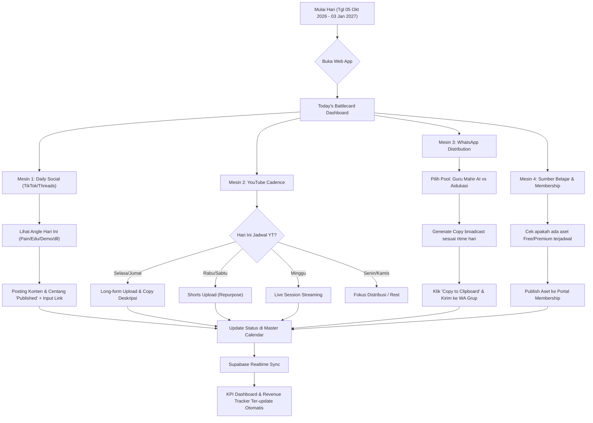

# MAP ARSITEKTUR & SISTEM: PAK HUSNUL MASTER CONTENT OPERATING SYSTEM (90 HARI)

Dokumen ini memetakan arsitektur menyeluruh, pemetaan lembar kerja Excel ke basis data, skema relasional Supabase PostgreSQL, struktur navigasi (Site Map), dan alur data aplikasi web responsif (Desktop & Mobile).

---

## 1. IKHTISAR SISTEM & SUMBER DATA EXCEL

Sistem ini mentransformasikan workbook Excel **`PAK_HUSNUL_Master_Content_Operating_System_90_Hari_START_5_OKTOBER_2026.xlsx`** yang terdiri dari 12 sheet menjadi sebuah Web App terpadu yang adaptif di layar Desktop dan Smartphone:

| No | Sheet Excel Sumber | Fungsi Bisnis di Excel | Modul Web App | Entitas Supabase Terkait |
|:---|:---|:---|:---|:---|
| 1 | **Dashboard** | Kalkulator ekonomi 500K/hari, asumsi fixed cost, AOV terbobot, target per fase. | Executive Revenue Dashboard & Interactive Simulator | `system_config`, `hero_products`, `revenue_phases` |
| 2 | **START HERE** | Visi, prinsip operasional (1 Weekly Theme), hirarki prioritas (P0–P3). | Onboarding, Rulebook Modal, & SOP Drawer | `operating_rules`, `system_config` |
| 3 | **CONFIG** | Kontrol tanggal (5 Okt 2026 – 3 Jan 2027), hero product, cadence media sosial & YT. | App Settings & Global Filters | `system_config` |
| 4 | **WEEKLY CLUSTERS** | 13 tema mingguan menyatukan revenue, YouTube, Sumber Belajar, WA, & target omset. | 13-Week Sprint Board (Kanban / Matrix) | `weekly_clusters` |
| 5 | **MASTER CALENDAR** | 91 baris harian mengintegrasikan 5 mesin (Social, YT, Sumber Belajar, App, WA). | 90-Day Master Calendar Cockpit (Grid/Table/List) | `master_calendar` |
| 6 | **SUMBER BELAJAR** | 50 aset digital untuk 6 menu & tier (FREE, PREMIUM, PUBLIC/FREE). | Asset & Membership Hub (Vault & Pipeline) | `sumber_belajar` |
| 7 | **DAILY PRODUCT** | 91 hari tracker konten harian TikTok & Threads dengan 7 angle berputar. | Daily Social Studio & Publishing Tracker | `daily_product_content` |
| 8 | **YT ALIGNMENT** | Sinkronisasi video Long-form (#1 & #2), Shorts, dan Live tanpa over-workload. | YouTube Growth Command Center | `youtube_schedule` |
| 9 | **WA DISTRIBUTION** | Panduan ritme 7 hari WhatsApp: Guru Mahir AI (public) vs Aidukasi (closed). | WhatsApp Distribution Station & Copy Generator | `wa_distribution_playbook` |
| 10 | **KPI DASHBOARD** | North star revenue, target frekuensi post, rasio konversi membership. | Live KPI & Analytics Cockpit | `kpi_metrics`, `daily_performance_logs` |
| 11 | **SOURCE REVENUE** | Roadmap 90 hari revenue, kampanye primer, aksi affiliate, aksi WA. | Strategic Revenue Roadmap & Campaign Tracker | Terintegrasi di `weekly_clusters` & `revenue_phases` |
| 12 | **SOURCE YOUTUBE** | Roadmap YouTube asli dari source of truth (fase, topik, target jam tayang). | Terintegrasi di `youtube_schedule` & `weekly_clusters` | Terintegrasi di `youtube_schedule` |

---

## 2. ARSITEKTUR TEKNOLOGI & DATA FLOW

### 2.1 Arsitektur Stack

```
+-----------------------------------------------------------------------------------+
|                                  USER CLIENT                                      |
|   Desktop Browser (1440px / 1920px)          Mobile Browser / PWA (375px - 430px) |
|   - Collapsible Sidebar & Breadcrumbs        - Sticky Bottom Bar & Drawer Navigation|
|   - Multi-column Cockpit & Split View        - Single-column Stack & Card Swipers |
+-----------------------------------------+-----------------------------------------+
                                          |
                                          v
+-----------------------------------------------------------------------------------+
|                        FRONTEND WEB APP (Vanilla / Vite React)                    |
|   - State Management: Optimistic UI + Reactive Local Store + Realtime Synced      |
|   - Offline-first cache: localStorage / IndexedDB fallback                        |
|   - Design System: Dark Slate Obsidian + Emerald (Revenue) + Amber/Cyan Accents   |
+-----------------------------------------+-----------------------------------------+
                                          | (HTTPS / WSS Realtime)
                                          v
+-----------------------------------------------------------------------------------+
|                               SUPABASE BACKEND                                    |
|   Project URL: https://gaxjcaxvizhvqxxxzagq.supabase.co                           |
|                                                                                   |
|   +------------------------------------+  +-------------------------------------+  |
|   |         PostgreSQL Database        |  |       Supabase Realtime Engine      |  |
|   |  - 10 Relational Tables (3NF)      |  |  - Instant sync across devices      |  |
|   |  - Automated Triggers & Rollups    |  |  - Broadcast status toggles         |  |
|   |  - Row Level Security (RLS)        |  +-------------------------------------+  |
|   +------------------------------------+                                           |
|   +------------------------------------+  +-------------------------------------+  |
|   |           REST API (PostgREST)     |  |       Supabase Storage (Optional)   |  |
|   |  - Filter, Sort, Pagination, RPC   |  |  - Media assets / cheatsheets       |  |
|   +------------------------------------+  +-------------------------------------+  |
+-----------------------------------------------------------------------------------+
```

### 2.2 Diagram Alur Data Operasional Harian



---

## 3. SKEMA DATABASE RELASIONAL (SUPABASE POSTGRESQL DDL)

Berikut adalah struktur skema lengkap yang dirancang untuk dieksekusi di Supabase PostgreSQL:

```sql
-- 1. EXTENSIONS
CREATE EXTENSION IF NOT EXISTS "uuid-ossp";

-- 2. ENUM TYPES
CREATE TYPE content_priority AS ENUM ('P0', 'P1', 'P2', 'P3');
CREATE TYPE task_status AS ENUM ('Planned', 'In Progress', 'Done', 'Past', 'Skipped');
CREATE TYPE content_tier AS ENUM ('PUBLIC/FREE', 'FREE', 'PREMIUM', 'VIP');
CREATE TYPE sumber_menu AS ENUM ('Bank Prompt', 'AI Skills', 'Tutorial', 'Apps', 'Others');
CREATE TYPE source_type AS ENUM ('Repurpose', 'Repurpose/Curated', 'Manual', 'App');
CREATE TYPE effort_level AS ENUM ('Low', 'Medium', 'High');

-- 3. SYSTEM CONFIG & ASSUMPTIONS
CREATE TABLE IF NOT EXISTS system_config (
    id UUID PRIMARY KEY DEFAULT uuid_generate_v4(),
    config_key VARCHAR(50) UNIQUE NOT NULL,
    target_net_per_day NUMERIC(12, 2) DEFAULT 500000.00,
    days_per_month INT DEFAULT 30,
    ai_sub_per_prod_per_month NUMERIC(12, 2) DEFAULT 350000.00,
    num_hero_products INT DEFAULT 2,
    domain_per_prod_per_year NUMERIC(12, 2) DEFAULT 250000.00,
    affiliate_commission_rate NUMERIC(4, 2) DEFAULT 0.40,
    affiliate_gross_share NUMERIC(4, 2) DEFAULT 0.25,
    control_date DATE DEFAULT '2026-10-04',
    start_date DATE DEFAULT '2026-10-05',
    end_date DATE DEFAULT '2027-01-03',
    wa_public_pool_name VARCHAR(100) DEFAULT 'Guru Mahir AI',
    wa_closed_pool_name VARCHAR(100) DEFAULT 'Aidukasi',
    updated_at TIMESTAMP WITH TIME ZONE DEFAULT NOW()
);

-- 4. HERO PRODUCTS & PRICING
CREATE TABLE IF NOT EXISTS hero_products (
    id UUID PRIMARY KEY DEFAULT uuid_generate_v4(),
    name VARCHAR(100) NOT NULL,
    price NUMERIC(12, 2) NOT NULL,
    sales_mix NUMERIC(4, 2) NOT NULL,
    weighted_value NUMERIC(12, 2) GENERATED ALWAYS AS (price * sales_mix) STORED,
    is_hero BOOLEAN DEFAULT TRUE,
    created_at TIMESTAMP WITH TIME ZONE DEFAULT NOW()
);

-- 5. REVENUE PHASES
CREATE TABLE IF NOT EXISTS revenue_phases (
    id UUID PRIMARY KEY DEFAULT uuid_generate_v4(),
    phase_number INT UNIQUE NOT NULL,
    name VARCHAR(50) NOT NULL,
    day_range VARCHAR(50) NOT NULL,
    start_day_index INT NOT NULL,
    end_day_index INT NOT NULL,
    target_net_per_day NUMERIC(12, 2) NOT NULL,
    target_net_30_days NUMERIC(12, 2) NOT NULL,
    target_gross_per_week NUMERIC(12, 2) NOT NULL,
    description TEXT
);

-- 6. WEEKLY CLUSTERS (13 WEEKS SPRINT)
CREATE TABLE IF NOT EXISTS weekly_clusters (
    id UUID PRIMARY KEY DEFAULT uuid_generate_v4(),
    week_number INT UNIQUE NOT NULL,
    start_date DATE NOT NULL,
    end_date DATE NOT NULL,
    fase_id INT REFERENCES revenue_phases(phase_number),
    revenue_focus VARCHAR(255) NOT NULL,
    primary_campaign VARCHAR(255) NOT NULL,
    youtube_focus VARCHAR(255) NOT NULL,
    yt_longform_1 VARCHAR(255),
    yt_longform_2 VARCHAR(255),
    yt_live VARCHAR(255),
    membership_cluster VARCHAR(255),
    sumber_belajar_outputs TEXT,
    primary_cta VARCHAR(255),
    wa_focus TEXT,
    audience_target TEXT,
    key_revenue_action TEXT,
    affiliate_action TEXT,
    coordination_rule TEXT,
    revenue_target_net NUMERIC(12, 2) DEFAULT 2450000.00,
    revenue_target_gross NUMERIC(12, 2),
    status task_status DEFAULT 'Planned',
    created_at TIMESTAMP WITH TIME ZONE DEFAULT NOW()
);

-- 7. MASTER CALENDAR (91 DAYS COCKPIT)
CREATE TABLE IF NOT EXISTS master_calendar (
    id UUID PRIMARY KEY DEFAULT uuid_generate_v4(),
    date DATE UNIQUE NOT NULL,
    day_name VARCHAR(20) NOT NULL,
    week_number INT NOT NULL REFERENCES weekly_clusters(week_number),
    weekly_theme VARCHAR(255) NOT NULL,
    revenue_focus VARCHAR(255) NOT NULL,
    daily_product_content TEXT NOT NULL,
    youtube_content TEXT,
    sumber_belajar_repurpose TEXT,
    apps_content TEXT,
    wa_distribution TEXT NOT NULL,
    primary_cta VARCHAR(255) NOT NULL,
    priority content_priority DEFAULT 'P0',
    status task_status DEFAULT 'Planned',
    notes TEXT,
    actual_completed_at TIMESTAMP WITH TIME ZONE,
    created_at TIMESTAMP WITH TIME ZONE DEFAULT NOW()
);

-- 8. DAILY PRODUCT CONTENT (TIKTOK & THREADS TRACKER)
CREATE TABLE IF NOT EXISTS daily_product_content (
    id UUID PRIMARY KEY DEFAULT uuid_generate_v4(),
    date DATE UNIQUE NOT NULL REFERENCES master_calendar(date),
    week_number INT NOT NULL REFERENCES weekly_clusters(week_number),
    campaign_focus VARCHAR(255) NOT NULL,
    recommended_product VARCHAR(255) NOT NULL,
    channel_minimum VARCHAR(50) DEFAULT '>= 1 post',
    content_angle VARCHAR(50) NOT NULL,
    cta VARCHAR(255) NOT NULL,
    status task_status DEFAULT 'Planned',
    is_published BOOLEAN DEFAULT FALSE,
    published_url TEXT,
    notes TEXT,
    created_at TIMESTAMP WITH TIME ZONE DEFAULT NOW()
);

-- 9. SUMBER BELAJAR ASSETS (50 ITEMS)
CREATE TABLE IF NOT EXISTS sumber_belajar (
    id VARCHAR(50) PRIMARY KEY, -- e.g. SB-W01-01
    week_number INT NOT NULL REFERENCES weekly_clusters(week_number),
    target_date DATE NOT NULL,
    source_asset VARCHAR(255) NOT NULL,
    menu sumber_menu NOT NULL,
    content_title VARCHAR(255) NOT NULL,
    tier content_tier NOT NULL,
    source_type source_type NOT NULL,
    production_effort effort_level NOT NULL,
    cta VARCHAR(255) NOT NULL,
    status task_status DEFAULT 'Planned',
    notes TEXT,
    created_at TIMESTAMP WITH TIME ZONE DEFAULT NOW()
);

-- 10. YOUTUBE SCHEDULE & ALIGNMENT
CREATE TABLE IF NOT EXISTS youtube_schedule (
    id UUID PRIMARY KEY DEFAULT uuid_generate_v4(),
    week_number INT UNIQUE NOT NULL REFERENCES weekly_clusters(week_number),
    start_date DATE NOT NULL,
    end_date DATE NOT NULL,
    fase VARCHAR(50) DEFAULT 'Repositioning',
    focus VARCHAR(255) NOT NULL,
    longform_1 VARCHAR(255) NOT NULL,
    longform_2 VARCHAR(255) NOT NULL,
    live_session VARCHAR(255) NOT NULL,
    shorts_count INT DEFAULT 2,
    watch_target INT DEFAULT 25,
    review_notes TEXT,
    integration_rule TEXT,
    status task_status DEFAULT 'Planned',
    created_at TIMESTAMP WITH TIME ZONE DEFAULT NOW()
);

-- 11. WA DISTRIBUTION PLAYBOOK
CREATE TABLE IF NOT EXISTS wa_distribution_playbook (
    id UUID PRIMARY KEY DEFAULT uuid_generate_v4(),
    day_name VARCHAR(20) UNIQUE NOT NULL,
    public_pool_theme VARCHAR(255) NOT NULL,
    closed_pool_theme VARCHAR(255) NOT NULL,
    purpose VARCHAR(255) NOT NULL,
    typical_cta VARCHAR(255) NOT NULL,
    do_not_rule TEXT NOT NULL,
    sample_template_public TEXT,
    sample_template_closed TEXT
);

-- 12. KPI METRICS & TRACKING
CREATE TABLE IF NOT EXISTS kpi_metrics (
    id UUID PRIMARY KEY DEFAULT uuid_generate_v4(),
    metric_name VARCHAR(100) UNIQUE NOT NULL,
    target_rule VARCHAR(100) NOT NULL,
    actual_value VARCHAR(100),
    status VARCHAR(50) DEFAULT 'Normal',
    notes TEXT,
    category VARCHAR(50) DEFAULT 'Operational',
    sort_order INT DEFAULT 0,
    updated_at TIMESTAMP WITH TIME ZONE DEFAULT NOW()
);

-- 13. ACTUAL SALES & PERFORMANCE LOGS (DAILY INPUT)
CREATE TABLE IF NOT EXISTS daily_sales_logs (
    id UUID PRIMARY KEY DEFAULT uuid_generate_v4(),
    log_date DATE UNIQUE NOT NULL,
    modulajar_qty INT DEFAULT 0,
    buatsoal_pro_qty INT DEFAULT 0,
    buatsoal_max_qty INT DEFAULT 0,
    other_products_amount NUMERIC(12, 2) DEFAULT 0.00,
    affiliate_commission_paid NUMERIC(12, 2) DEFAULT 0.00,
    gross_revenue NUMERIC(12, 2) DEFAULT 0.00,
    net_revenue NUMERIC(12, 2) DEFAULT 0.00,
    notes TEXT,
    created_at TIMESTAMP WITH TIME ZONE DEFAULT NOW()
);

-- INDEXES FOR FAST FILTERING & CALENDAR RENDERING
CREATE INDEX idx_master_calendar_date ON master_calendar(date);
CREATE INDEX idx_master_calendar_week ON master_calendar(week_number);
CREATE INDEX idx_master_calendar_status ON master_calendar(status);
CREATE INDEX idx_daily_product_date ON daily_product_content(date);
CREATE INDEX idx_sumber_belajar_week ON sumber_belajar(week_number);
CREATE INDEX idx_sumber_belajar_tier ON sumber_belajar(tier);
CREATE INDEX idx_sumber_belajar_menu ON sumber_belajar(menu);
```

---

## 4. SITE MAP & STRUKTUR NAVIGASI

Aplikasi web dirancang dengan arsitektur navigasi responsif modular:

```
+-------------------------------------------------------------------------------------+
|                                      APP ROOT                                       |
+------------------------------------------+------------------------------------------+
                                           |
    +--------------------------------------+-------------------------------------+
    |                                      |                                     |
    v                                      v                                     v
[1. Executive Dashboard]           [2. Master Calendar]                 [3. Weekly Sprints]
 - 500K/Day North Star Run-Rate    - 91-Day Cockpit Table & Grid        - 13 Weeks Kanban / Cards
 - Today's Battlecard Card         - Date / Week / Phase Filter         - Revenue & YT Sync Detail
 - Revenue Phase Progress (1, 2, 3)- Quick Status Toggle                - Deliverable Checklist
 - Quick Action Shortcuts          - Day Drawer Inspection              - Target vs Actual Gross/Net
    |                                      |                                     |
    +--------------------------------------+-------------------------------------+
    |                                      |                                     |
    v                                      v                                     v
[4. Daily Social Studio]           [5. YouTube Command]                 [6. WhatsApp Station]
 - 91-Day TikTok/Threads Tracker   - Fixed 5-Slot Cadence Monitor       - Guru Mahir AI (Public)
 - 7 Content Angle Carousel        - 2 Long-form + 2 Shorts + 1 Live    - Aidukasi (Closed)
 - One-Tap "Published" Toggle      - Watch Hours Target (25h - 130h)    - 1-Click Copy Broadcast
 - URL Input & Notes               - No-Overlap Protection Guard        - Do-Not Policy Alert
    |                                      |                                     |
    +--------------------------------------+-------------------------------------+
    |                                      |                                     |
    v                                      v                                     v
[7. Sumber Belajar Vault]          [8. Revenue Simulator]               [9. KPI & System Settings]
 - 50 Digital Asset Backlog        - Dynamic Assumptions Calculator     - 11 Cross-engine Metrics
 - Filter: 5 Menus & 3 Tiers       - AOV & Product Mix Sliders          - Supabase Sync Status
 - Repurpose Source Inspector      - Affiliate Retained Factor Simulator- Excel Export / Re-import
 - Production Effort Tag (L/M/H)   - Break-even & Daily Run-rate        - Dark Mode & Sound Config
```

---

## 5. RESPONSIVE LAYOUT MATRIX (DESKTOP VS MOBILE)

| Komponen / Halaman | Tampilan Desktop (>= 1024px) | Tampilan Mobile (< 768px) |
|:---|:---|:---|
| **Navigasi Global** | Fixed Collapsible Sidebar (kiri, 260px) + Header Bar dengan Control Date & Phase Badge. | Floating Bottom Navigation Bar (5 core icon tabs) + Top Bar dengan Burger Menu untuk Secondary Pages. |
| **Today's Battlecard** | Hero Widget di Dashboard (kiri atas) dengan 4 pilar mesin berdampingan (Social, YT, WA, SB). | Sticky Carousel Card swipeable di bagian paling atas beranda dengan checkbox instan. |
| **Master Calendar** | Dense Multi-column Data Grid dengan freeze header, search, filter chips, dan inline status dropdown. | Horizontal Week Strip (Pill selector) + Vertical Accordion Day Cards dengan expandable drawer. |
| **Daily Social Studio** | Side-by-side: Jadwal 7 hari di kiri, detail konten & URL publisher di kanan. | Tab harian + full-screen modal input URL postingan TikTok/Threads. |
| **WhatsApp Station** | Kolom ganda: Kiri untuk Pool Public (Guru Mahir AI), Kanan untuk Pool Closed (Aidukasi). | Segmented Tab Switcher (Public vs Closed) dengan tombol mengambang "Salin ke WhatsApp". |
| **Sumber Belajar** | Filterable Data Grid dengan sorting berdasarkan Menu, Tier, dan Effort + Badge warna. | Card Feed dengan Filter Chips horizontal di atas + search bar. |
| **Revenue Simulator** | Split-screen: Panel input slider di kiri, visualisasi hasil & grafik breakdown di kanan. | Single column vertical form dengan sticky floating summary card di bawah layar. |

---

## 6. STRATEGI MIGRASI & SEEDING DARI EXCEL KE SUPABASE

1. **Ekstraksi Data Terstruktur**: Menggunakan script Python (`openpyxl`) untuk membaca ke-12 sheet Excel dan mengonversinya menjadi payload JSON yang bersih dan tervalidasi.
2. **Koneksi Supabase Service Role**: Melakukan provisioning skema tabel dan seeding data awal menggunakan endpoint REST API Supabase dengan `service_role` key untuk bypass RLS pada inisialisasi awal.
3. **Data Integrity Check**:
   - Memastikan 91 baris `master_calendar` cocok 100% dengan `daily_product_content`.
   - Memastikan 13 minggu `weekly_clusters` memiliki relasi tepat ke 3 fase revenue.
   - Memastikan 50 baris `sumber_belajar` terpetakan ke minggu dan target date yang tepat.
4. **Realtime Re-sync**: Menambahkan tombol sinkronisasi di aplikasi web yang memungkinkan admin mengekspor kembali data ke Excel atau mengimpor update terbaru secara aman.
